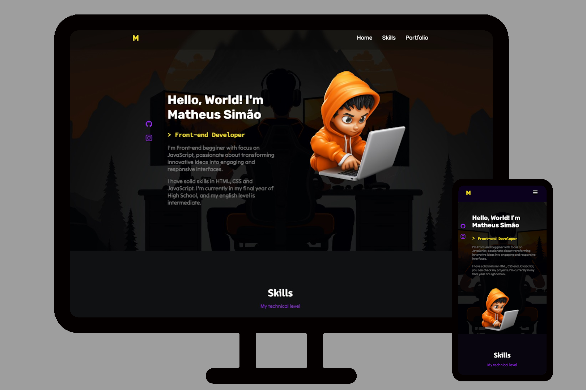

# Portfólio

Welcome to my portfolio!

In my portfolio, I speak little more about me, my projects and my skills. Go there and check it out!

[Click here to visit](https://matsimao.vercel.app)

## 🔨 Tools

- [FlexBox](https://css-tricks.com/snippets/css/a-guide-to-flexbox/)
- [Grid Layout](https://developer.mozilla.org/pt-BR/docs/Web/CSS/CSS_grid_layout/Basic_concepts_of_grid_layout)

### Build with

- [Html](https://developer.mozilla.org/pt-BR/docs/Web/HTML)
- [Css](https://developer.mozilla.org/pt-BR/docs/Web/CSS)
- [JavaScript](https://developer.mozilla.org/pt-BR/docs/Web/JavaScript)
- [Bootstrap](https://getbootstrap.com)
- [TypeIt JS](https://www.typeitjs.com)
